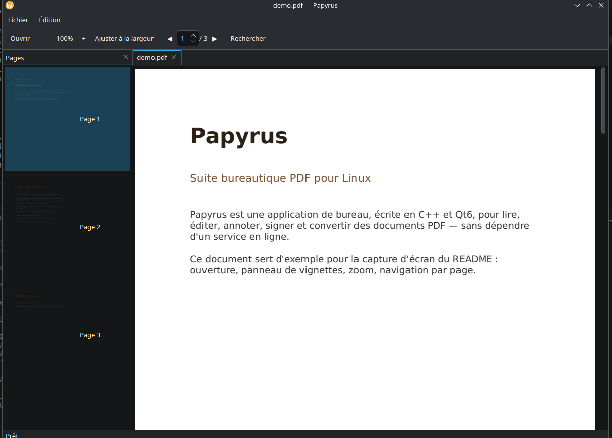

# Papyrus

[](https://github.com/Ade-gns/Papyrus/releases/latest)
[](LICENSE)

Suite bureautique PDF pour Linux — lecture, édition, annotation, signature, OCR et conversion, dans une application de bureau native (C++ / Qt6), sans dépendre d'un service en ligne.



## Fonctionnalités

- **Lecture** : onglets multi-documents, zoom, navigation par page, recherche plein texte, panneau de vignettes, glisser-déposer
- **Édition de pages** : rotation, suppression, duplication, réorganisation, extraction, fusion de plusieurs PDF
- **Modification de texte** : cliquer sur un mot déjà présent dans le PDF pour le corriger
- **Annotations** : surlignage, rectangle, cercle
- **Signature** : dessin à la souris, import d'image (fond blanc supprimé automatiquement), saisie au clavier avec polices manuscrites, placement avec rotation
- **OCR** (Tesseract) : rend un PDF scanné recherchable
- **Formulaires** : remplissage de champs texte, cases à cocher, listes déroulantes
- **Conversion Office** : DOC/DOCX/ODT, PPT/PPTX/ODP → PDF (via LibreOffice headless)
- **Création de PDF** : depuis un fichier texte ou une série d'images
- **Impression** native (CUPS), aperçu avant impression
- **Undo/Redo** multi-niveaux et récupération automatique après une fermeture inattendue
- **Vérification des mises à jour** : menu Aide, ou automatique et discrète au démarrage (ne prévient que si une version plus récente existe)

Le détail de chaque phase de développement et les choix techniques sont documentés dans [`PROGRESS.md`](PROGRESS.md).

## Installation

### Paquets pré-compilés

Les paquets `.deb`, `.rpm` et l'AppImage sont disponibles sur la page des [releases GitHub](https://github.com/Ade-gns/Papyrus/releases/latest) — téléchargez celui qui correspond à votre distribution et suivez les instructions ci-dessous pour l'installer. S'il n'y a pas encore de release publiée, compilez depuis les sources avec les instructions suivantes.

### En une commande (Debian / Ubuntu et dérivés)

```bash
curl -fsSL https://raw.githubusercontent.com/Ade-gns/Papyrus/main/scripts/install.sh | bash
```

Télécharge les dépendances de compilation, compile Papyrus, génère un `.deb` et l'installe via `apt` (deux invites `sudo` : dépendances, puis le paquet). Aucune release pré-compilée n'est publiée pour l'instant, donc ça compile depuis les sources (~5-10 minutes). Fonctionne aussi depuis un clone existant : `./scripts/install.sh`.

### Paquet `.deb` manuellement

```bash
git clone https://github.com/Ade-gns/Papyrus.git
cd Papyrus
scripts/fetch-pdfium.sh
cmake -S . -B build -DCMAKE_BUILD_TYPE=Release
cmake --build build -j"$(nproc)"
cd build && cpack -G DEB
sudo apt install ./papyrus_*.deb
```

### Compiler et lancer sans installer

```bash
git clone https://github.com/Ade-gns/Papyrus.git
cd Papyrus
scripts/fetch-pdfium.sh          # télécharge PDFium (vendorisé, pas commité)
cmake -S . -B build -DCMAKE_BUILD_TYPE=Debug
cmake --build build -j"$(nproc)"
./build/app/papyrus
```

### AppImage (portable, sans installation)

```bash
git clone https://github.com/Ade-gns/Papyrus.git
cd Papyrus
scripts/fetch-pdfium.sh
cmake -S . -B build -DCMAKE_BUILD_TYPE=Release
cmake --build build -j"$(nproc)"
scripts/build-appimage.sh
./build/Papyrus-x86_64.AppImage
```

Produit `build/Papyrus-x86_64.AppImage` : embarque Qt6 et PDFium, fonctionne sur la plupart des distributions sans rien installer (juste `chmod +x` puis exécuter). `scripts/build-appimage.sh` télécharge automatiquement `linuxdeploy`/`appimagetool` (vérifiés par somme de contrôle) au premier lancement.

### Paquet `.rpm` (Fedora / openSUSE et dérivés)

```bash
git clone https://github.com/Ade-gns/Papyrus.git
cd Papyrus
scripts/fetch-pdfium.sh
cmake -S . -B build -DCMAKE_BUILD_TYPE=Release
cmake --build build -j"$(nproc)"
cd build && cpack -G RPM
sudo dnf install ./papyrus-*.x86_64.rpm   # ou : sudo zypper install ./papyrus-*.x86_64.rpm
```

⚠️ Ce `.rpm` est construit et testé sur une machine Debian/Ubuntu, sans détection automatique fiable des dépendances Fedora (noms de paquets Qt6 différents entre distributions, pas de base RPM locale sur une machine `dpkg`). Les dépendances (`qt6-qtbase`, `qt6-qtpdf`) sont donc renseignées à la main dans `CMakeLists.txt` et n'ont pas été vérifiées sur une vraie installation Fedora/openSUSE — une confirmation ou correction par quelqu'un utilisant réellement ces distributions est bienvenue.

### Dépendances système

| Paquet | Rôle |
|---|---|
| `qt6-base-dev`, `qt6-pdf-dev` | requis pour compiler |
| `qt6-base-dev-tools` | requis pour `scripts/build-appimage.sh` (fournit `qmake6`) |
| `libreoffice-writer`, `libreoffice-impress` | conversion Office → PDF (optionnel à l'exécution) |
| `tesseract-ocr` (+ `tesseract-ocr-fra` pour le français) | OCR (optionnel à l'exécution) |

PDFium est vendorisé (téléchargé par `scripts/fetch-pdfium.sh`, non commité dans le dépôt).

### Autres formats

Flatpak n'est pas encore disponible : bloqué par l'absence du module Qt6 Pdf dans le runtime KDE (détails dans [`PROGRESS.md`](PROGRESS.md)).

## Limitations connues

- Le visualiseur principal (`QPdfView`) n'affiche pas les annotations (limitation de Qt) — elles sont bien enregistrées dans le fichier et visibles dans tout autre lecteur PDF. Les signatures et images insérées, elles, sont bien visibles dans Papyrus car intégrées comme vrai contenu de page.
- Annotations dessin libre, lignes/flèches et zones de texte libre non supportées (seuls surlignage, rectangle et cercle le sont).
- Pas de création de nouveaux champs de formulaire, ni de support des formulaires XFA.
- Une seule image par page pour la création de PDF depuis des images.
- Modification de texte : le mot d'origine est recouvert puis remplacé visuellement, mais reste présent dans la couche invisible du PDF (recherche/copier-coller) — pas adapté à un usage de confidentialité/rédaction.

Détails complets dans [`PROGRESS.md`](PROGRESS.md).

## Contribuer

Le projet en est à ses débuts. Les *issues* et *pull requests* sont bienvenues — pour un changement conséquent, ouvrez d'abord une *issue* pour en discuter. `PROGRESS.md` liste les pièges techniques déjà rencontrés (utile avant de toucher au moteur PDFium).

## Licence

Papyrus est distribué sous licence [MIT](LICENSE).

Il s'appuie sur :
- [PDFium](https://pdfium.googlesource.com/pdfium/) (BSD-3-Clause) et ses propres dépendances tierces (voir `third_party/pdfium/licenses/` après `scripts/fetch-pdfium.sh`)
- [Qt6](https://www.qt.io/) (LGPLv3, lié dynamiquement)
- [LibreOffice](https://www.libreoffice.org/) et [Tesseract OCR](https://github.com/tesseract-ocr/tesseract), invoqués comme processus externes, sous leurs licences respectives
- Polices manuscrites sous [SIL Open Font License](app/resources/fonts/OFL.txt)
